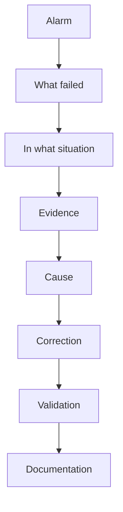

# Roberto Jeronimo da Cunha

**IT and Industrial Infrastructure Coordinator · Linux · Networks · Information Security · Python · PHP · Industrial Automation**

Campinas, São Paulo, Brazil

[Português](README.md) · [LinkedIn](https://www.linkedin.com/in/robertojeronimo/) · beto1979@gmail.com · roberto@cunha.net.br · +55 19 99255-9334

I work in IT infrastructure and industrial maintenance. At [Planifer Ferramentaria e Estamparia](#experience), since 2006, that means Linux servers, networks, automation, and the shop floor. The starting point is the observed fact, not the assumption.

## Contents

- [About](#about)
- [Experience](#experience)
- [What I do](#what-i-do)
- [Technologies](#technologies)
- [Projects](#projects)
- [Troubleshooting and problem solving](#troubleshooting)
- [Technical background](#technical-background)
- [Currently studying](#currently-studying)
- [Education](#education)
- [Certifications](#certifications)
- [Languages](#languages)
- [How I work](#how-i-work)
- [Repository](#repository)

## About

Bachelor's degree in Computer Science and a technical qualification in Industrial Informatics from Centro Universitário Salesiano de São Paulo (UNISAL). Professional work in technology started in 1998, in IT support, and continued through electronics maintenance, infrastructure, and development.

Since March 2006 I have been at Planifer Ferramentaria e Estamparia, in Campinas, between IT infrastructure and industrial maintenance. The daily work covers Linux servers, Samba Active Directory, networking, proxy, VPN, Python and PHP applications, and the link between that and machines, maintenance, and indicators.

In practice that shows up as troubleshooting: read the alarm, locate what failed, collect evidence, and only then make a change.

## Experience

### Planifer Ferramentaria e Estamparia

Industrial Maintenance Technician · IT Infrastructure and Automation

March 2006 — present · Campinas region

- Server administration and migration of critical services to Ubuntu Server with Samba Active Directory
- Central authentication, access policy, and permissions
- Mail (Postfix), proxy (Squid), VPN (OpenVPN), DNS, and file shares
- Corporate information access rebuilt around a web application, replacing exposed shares
- A NOC for continuous infrastructure monitoring
- Applications in Python (FastAPI, Selenium) and PHP (HTMX, DataTables), with SQL Server and Supabase
- Tools for monitoring, inventory, industrial maintenance, and system integration
- PowerShell automation, JSON/UTF-8 logs, and an audit trail
- Technical leadership and mentoring during incident response
- Technical interface in aerospace customer audits against AS9100 and NADCAP
- Feasibility studies (CAPEX/OPEX) for infrastructure and energy efficiency

### Liceu Coração de Jesus

Electronics Maintenance Technician

April 2002 — March 2006 · Campinas region

Continuation of the infrastructure started at Escola Salesiana São José, for the same academic community.

- Novell NetWare administration
- Email accounts, users, and access policy for more than 1,000 students, teachers, and administrative staff
- Preventive maintenance of computer labs and support for administrative areas
- Standard operating system images for installation and recovery

### Escola Salesiana São José

Electronics Maintenance Technician

September 2001 — April 2002 · Campinas region

- Novell NetWare network administration
- Users, email accounts, and permissions
- Support for computer labs and administrative areas
- Preventive and corrective maintenance of computers and peripherals

### A. Carvalho & Souza Ltda

Computer Technician

January 2001 — September 2001 · Campinas region

- Preventive and corrective maintenance of computers and printers under warranty
- Bench and field service for public and private customers
- Diagnosis, parts replacement, testing, and restoration within the warranty standard

### Sudeste Serviços de Terceirização Ltda.

General Services Assistant

January 1998 — September 2001 · Campinas region

Outsourced to the IT secretariat of TRT da 15ª Região.

- Preventive and corrective maintenance of computers used by administrative and court units
- Remote support and phone support
- Installation and standardization of workstations
- Participation in the IT preparation for the year 2000 transition

## What I do

<table>
  <tr>
    <td valign="top" width="33%">
      <h3>Infrastructure &amp; IT</h3>
      <ul>
        <li>Linux Server</li>
        <li>Samba Active Directory</li>
        <li>Networking</li>
        <li>DNS</li>
        <li>DHCP</li>
        <li>Proxy</li>
        <li>Firewall</li>
        <li>VPN</li>
        <li>Backup</li>
        <li>Monitoring</li>
        <li>Virtualization</li>
      </ul>
    </td>
    <td valign="top" width="33%">
      <h3>Development &amp; Automation</h3>
      <ul>
        <li>Python</li>
        <li>PowerShell</li>
        <li>Bash</li>
        <li>PHP</li>
        <li>JavaScript</li>
        <li>PostgreSQL</li>
        <li>APIs</li>
        <li>Web applications</li>
        <li>Automation</li>
      </ul>
    </td>
    <td valign="top" width="33%">
      <h3>Industrial</h3>
      <ul>
        <li>CNC</li>
        <li>Industrial maintenance</li>
        <li>Preventive maintenance</li>
        <li>Corrective maintenance</li>
        <li>Electrical systems</li>
        <li>Electronics</li>
        <li>Industrial networks</li>
        <li>Industry 4.0</li>
        <li>CMMS / EAM</li>
      </ul>
    </td>
  </tr>
</table>

JavaScript is part of the web application work. It is not the center of the profile. Infrastructure, automation, and maintenance are.

## Technologies

These are technologies I have worked with or studied. Depth is not the same across the list.

### Operating systems

Linux · Ubuntu Server · Windows Server · Windows

### Infrastructure

Samba AD · DNS · DHCP · Postfix · Nginx · Squid · Proxmox · ZFS

### Networking

MikroTik · VLAN · OpenVPN · TCP/IP · Routing · Switching

### Development

Python (FastAPI) · PHP (HTMX) · PowerShell · Bash · JavaScript · SQL

### Databases

PostgreSQL · SQL Server · Supabase

### Monitoring

Grafana · dashboards · logs · Syslog · monitoring systems

### Industrial

CNC · Siemens · Mazak · DMG Mori · Romi · maintenance systems

## Projects

The write-ups cover the problem, the architecture, and the intended outcome. Application source, live topology, and operational data are not published.

### Planifer InfraMonitor

A dashboard for IT infrastructure: servers, availability, backups, internet, VPN, logs, indicators, and alerts.

[Problem, architecture, and boundaries](projects/inframonitor/README.md)

### CMMS / EAM for industrial maintenance

Machine and equipment management: registry, tags, preventive plans, corrective work, work orders, history, inventory, and indicators (MTBF, MTTR, OEE).

[Problem, architecture, and indicators](projects/cmms/README.md)

### Administrative task automation

PowerShell, Python, and Bash routines for system summary, disk space, service state, logs, network reachability, and backup file age. The scripts in this repository run on their own. They do not depend on a real network.

[Publishable examples](projects/other/README.md)

## Troubleshooting and problem solving

A careful investigation is worth more than a lucky swap. Diagnosis starts with the alarm and the evidence. A hypothesis comes later, and it stays only if the facts support it.

1. Identify the alarm
2. Identify what is showing the problem
3. Understand the situation in which it happened
4. Collect evidence
5. Identify the cause
6. Correct it
7. Validate
8. Document

Illustrated cases, using fictional names and addresses:

- [Linux](documentation/troubleshooting/linux.md)
- [Samba / Kerberos](documentation/troubleshooting/samba-kerberos.md)
- [Windows](documentation/troubleshooting/windows.md)
- [Networking](documentation/troubleshooting/networking.md)
- [Backup](documentation/troubleshooting/backup.md)
- [Database](documentation/troubleshooting/database.md)
- [Industrial machines](documentation/troubleshooting/industrial-machines.md)

[Full method](documentation/troubleshooting/README.md)

## Technical background

| Area | Background |
|---|---|
| Linux | Ubuntu Server, services, logs, systemd |
| Windows | Windows Server, PowerShell, GPO |
| Active Directory | Samba AD, DNS, Kerberos |
| Networking | TCP/IP, VLAN, OpenVPN, routing |
| Virtualization | Proxmox, virtual machines |
| Storage | ZFS, backup, recovery |
| Development | Python (FastAPI), PHP (HTMX), Bash, PowerShell |
| Databases | PostgreSQL, SQL Server, Supabase |
| Industrial | CNC, maintenance, electronics |
| Monitoring | dashboards, logs, alerts |
| Security | hardening, access control, backups |

## Currently studying

Topics under study. Completion and institution are not stated when that information is not available.

- MBA in Maintenance Management, in progress
- Industrial management
- Data Science and Analytics
- Industry 4.0
- Lean Manufacturing
- TPM
- OEE
- Supply Chain
- Production management

[Study notes](documentation/studies/README.md)

## Education

- Bachelor's degree in Computer Science, Centro Universitário Salesiano de São Paulo (UNISAL), 2004–2008
- Technical education in Industrial Informatics, UNISAL, 2002–2004
- MBA / postgraduate studies in Maintenance Management, in progress

## Certifications

Completed courses. Issuer, date, and credential code are listed in [documentation/certificacoes.md](documentation/certificacoes.md).

- First-line Leadership, FM2S, 2025
- Nonviolent Communication, Assertive Communication, and Emotional Intelligence, FM2S, 2025
- Corporate Excel, basic to advanced, Supernova Treinamentos, 2018
- NR-35 — Work at Height, Planifer, 2012
- Programmable Logic Controllers, UNISAL, 2002
- Maintenance Planning and Control, SigaConsulting, 2007
- Mechanical and electro-electronic maintenance, Siemens 810D, ROMI, 2008
- Reducing electrical energy costs in installations, CIESP Campinas, 2010
- Electrical maintenance and mechanical maintenance, INDEX, 2011
- Application and maintenance of industrial bearings, Radial Rolamentos, 2018

## Languages

- Portuguese
- English, limited working proficiency

## How I work

Understand what the operation needs, and act ahead of it. The infrastructure that keeps the plant running is one system: electrical power, compressed air, and IT. Do not wait for the machine or the service to stop. See what is forming and act before the problem happens or gets worse.

- Read the need before building the solution
- Treat electrical power, compressed air, and IT as parts of the same process
- Act on a weak signal, a drift, or a recurrence while there is still room to maneuver
- Confirm with evidence, correct the cause, and record what was seen

## Repository

| Folder | Contents |
|---|---|
| [infrastructure](infrastructure/README.md) | Linux, Samba AD, networking, Proxmox, backup, monitoring, Squid |
| [automation](automation/README.md) | PowerShell, Python, Bash, and PHP examples |
| [industrial](industrial/README.md) | Maintenance, CNC, industrial monitoring, Industry 4.0 |
| [projects](projects/README.md) | InfraMonitor, CMMS, and automation notes |
| [documentation](documentation/README.md) | Troubleshooting, architecture, procedures, studies |
| [examples](examples/README.md) | Lab configurations and diagrams |

Examples use documentation references only: `example.com`, `192.0.2.0/24`, `198.51.100.0/24`, `203.0.113.0/24`, and `10.0.0.0/24`.

Example code is under the [MIT](LICENSE) license.

Suggested profile bio, description, and link placeholders: [documentation/profile-github.md](documentation/profile-github.md).
