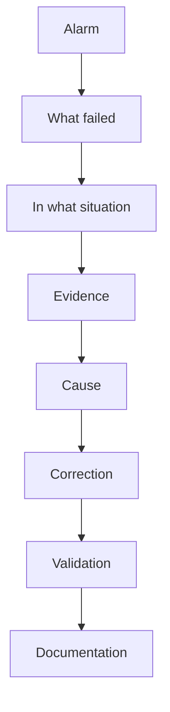

# Roberto Jeronimo da Cunha

**Electronics Maintenance Technician · IT and Infrastructure Management · Industrial Maintenance · Automation**

[Português](README.md)

I have worked in IT infrastructure and industrial maintenance since 2006. The work combines Linux server administration, networks, automation, and the shop floor: machines, maintenance, and the point where those environments meet. The starting point is the observed fact, not the assumption.

## Contents

- [About](#about)
- [What I do](#what-i-do)
- [Technologies](#technologies)
- [Projects](#projects)
- [Troubleshooting and problem solving](#troubleshooting)
- [Technical background](#technical-background)
- [Currently studying](#currently-studying)
- [Education](#education)
- [How I work](#how-i-work)
- [Repository](#repository)

## About

Professional experience since 2006, with a degree in Computer Science and a technical background in Industrial Informatics.

The path covers IT infrastructure, Linux server administration, networks, operational security, automation, and internal tools. On the industrial side it includes electronics maintenance, CNC machines, maintenance management, and the integration of IT with operations.

In practice that shows up as troubleshooting: read the alarm, locate what failed, collect evidence, and only then make a change.

## What I do

<table>
  <tr>
    <td valign="top" width="33%">
      <h3>Infrastructure &amp; IT</h3>
      <ul>
        <li>Linux Server</li>
        <li>Samba Active Directory</li>
        <li>Networking</li>
        <li>DNS</li>
        <li>DHCP</li>
        <li>Proxy</li>
        <li>Firewall</li>
        <li>VPN</li>
        <li>Backup</li>
        <li>Monitoring</li>
        <li>Virtualization</li>
      </ul>
    </td>
    <td valign="top" width="33%">
      <h3>Development &amp; Automation</h3>
      <ul>
        <li>Python</li>
        <li>PowerShell</li>
        <li>Bash</li>
        <li>PHP</li>
        <li>JavaScript</li>
        <li>PostgreSQL</li>
        <li>APIs</li>
        <li>Web applications</li>
        <li>Automation</li>
      </ul>
    </td>
    <td valign="top" width="33%">
      <h3>Industrial</h3>
      <ul>
        <li>CNC</li>
        <li>Industrial maintenance</li>
        <li>Preventive maintenance</li>
        <li>Corrective maintenance</li>
        <li>Electrical systems</li>
        <li>Electronics</li>
        <li>Industrial networks</li>
        <li>Industry 4.0</li>
        <li>CMMS / EAM</li>
      </ul>
    </td>
  </tr>
</table>

JavaScript is part of the web application work. It is not the center of the profile. Infrastructure, automation, and maintenance are.

## Technologies

These are technologies I have worked with or studied. Depth is not the same across the list.

### Operating systems

Linux · Ubuntu Server · Windows Server · Windows

### Infrastructure

Samba AD · DNS · DHCP · Nginx · Squid · Proxmox · ZFS

### Networking

MikroTik · VLAN · VPN · TCP/IP · Routing · Switching

### Development

Python · PHP · PowerShell · Bash · JavaScript · SQL

### Databases

PostgreSQL · SQL Server

### Monitoring

Grafana · dashboards · logs · Syslog · monitoring systems

### Industrial

CNC · Siemens · Mazak · DMG Mori · Romi · maintenance systems

## Projects

The write-ups cover the problem, the architecture, and the intended outcome. Application source, live topology, and operational data are not published.

### Planifer InfraMonitor

A dashboard for IT infrastructure: servers, availability, backups, internet, VPN, logs, indicators, and alerts.

[Problem, architecture, and boundaries](projects/inframonitor/README.md)

### CMMS / EAM for industrial maintenance

Machine and equipment management: registry, tags, preventive plans, corrective work, work orders, history, inventory, and indicators (MTBF, MTTR, OEE).

[Problem, architecture, and indicators](projects/cmms/README.md)

### Administrative task automation

PowerShell, Python, and Bash routines for system summary, disk space, service state, logs, network reachability, and backup file age. The scripts in this repository run on their own. They do not depend on a real network.

[Publishable examples](projects/other/README.md)

## Troubleshooting and problem solving

A careful investigation is worth more than a lucky swap. Diagnosis starts with the alarm and the evidence. A hypothesis comes later, and it stays only if the facts support it.

1. Identify the alarm
2. Identify what is showing the problem
3. Understand the situation in which it happened
4. Collect evidence
5. Identify the cause
6. Correct it
7. Validate
8. Document

Illustrated cases, using fictional names and addresses:

- [Linux](documentation/troubleshooting/linux.md)
- [Samba / Kerberos](documentation/troubleshooting/samba-kerberos.md)
- [Windows](documentation/troubleshooting/windows.md)
- [Networking](documentation/troubleshooting/networking.md)
- [Backup](documentation/troubleshooting/backup.md)
- [Database](documentation/troubleshooting/database.md)
- [Industrial machines](documentation/troubleshooting/industrial-machines.md)

[Full method](documentation/troubleshooting/README.md)

## Technical background

| Area | Background |
|---|---|
| Linux | Ubuntu Server, services, logs, systemd |
| Windows | Windows Server, PowerShell, GPO |
| Active Directory | Samba AD, DNS, Kerberos |
| Networking | TCP/IP, VLAN, VPN, routing |
| Virtualization | Proxmox, virtual machines |
| Storage | ZFS, backup, recovery |
| Development | Python, PHP, Bash, PowerShell |
| Databases | PostgreSQL, SQL Server |
| Industrial | CNC, maintenance, electronics |
| Monitoring | dashboards, logs, alerts |
| Security | hardening, access control, backups |

## Currently studying

Topics under study. Completion and institution are not stated when that information is not available.

- MBA in Maintenance Management, in progress
- Industrial management
- Data Science and Analytics
- Industry 4.0
- Lean Manufacturing
- TPM
- OEE
- Supply Chain
- Production management

[Study notes](documentation/studies/README.md)

## Education

- Bachelor's degree in Computer Science
- Technical education in Industrial Informatics
- MBA / postgraduate studies in Maintenance Management, in progress

Institution, year, and certificate are not listed here.

## How I work

- Understand the problem before acting
- Work from evidence
- Document what was seen and what was done
- Automate a repeated task when that reduces error
- Look for the cause, not only the symptom
- Reduce downtime with a fix that holds
- Prefer a solution that is simple to operate and to maintain
- Connect technology to the operation
- Turn a recurring problem into a process

## Repository

| Folder | Contents |
|---|---|
| [infrastructure](infrastructure/README.md) | Linux, Samba AD, networking, Proxmox, backup, monitoring, Squid |
| [automation](automation/README.md) | PowerShell, Python, Bash, and PHP examples |
| [industrial](industrial/README.md) | Maintenance, CNC, industrial monitoring, Industry 4.0 |
| [projects](projects/README.md) | InfraMonitor, CMMS, and automation notes |
| [documentation](documentation/README.md) | Troubleshooting, architecture, procedures, studies |
| [examples](examples/README.md) | Lab configurations and diagrams |

Examples use documentation references only: `example.com`, `192.0.2.0/24`, `198.51.100.0/24`, `203.0.113.0/24`, and `10.0.0.0/24`.

Example code is under the [MIT](LICENSE) license.

Suggested profile bio, description, and link placeholders: [documentation/profile-github.md](documentation/profile-github.md).
