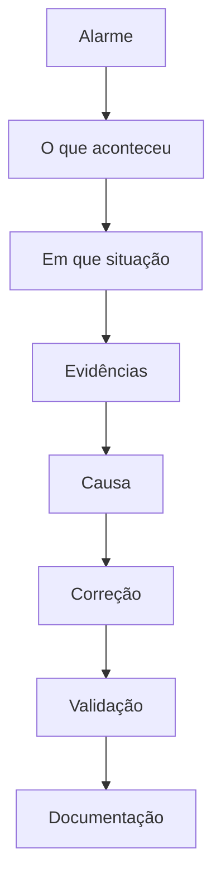

# Roberto Jeronimo da Cunha

**TI & Infraestrutura | Manutenção Industrial | Automação | Troubleshooting**

Trabalho com infraestrutura de TI e manutenção industrial desde 1998, e na Planifer Ferramentaria e Estamparia desde março de 2006. A atuação junta Linux, redes, automação e o chão de fábrica: elétrica, ar comprimido, máquinas e manutenção.

O diagnóstico vem antes da troca. Alarme, situação e evidências definem a causa. A correção entra depois.

Campinas, São Paulo, Brasil

[English](README.en.md) · [LinkedIn](https://www.linkedin.com/in/robertojeronimo/) · roberto@cunha.net.br


## Índice

- [Sobre mim](#sobre-mim)
- [Minha abordagem](#minha-abordagem)
- [Como eu trabalho](#como-eu-trabalho)
- [Experiência](#experiencia)
- [O que eu faço](#o-que-eu-faco)
- [Tecnologias](#tecnologias)
- [Projetos](#projetos)
- [Troubleshooting](#troubleshooting)
- [Conhecimento técnico](#conhecimento-tecnico)
- [Atualmente estudando](#atualmente-estudando)
- [Formação](#formacao)
- [Certificações](#certificacoes)
- [Idiomas](#idiomas)
- [O que não está publicado](#o-que-nao-esta-publicado)
- [Repositório](#repositorio)

<a id="sobre-mim"></a>

## Sobre mim

Bacharel em Ciência da Computação e técnico em Informática Industrial pelo Centro Universitário Salesiano de São Paulo (UNISAL). O percurso passa por suporte, manutenção eletrônica, infraestrutura Linux, Samba Active Directory, desenvolvimento em Python e PHP, e a integração entre TI e manutenção industrial.

<a id="minha-abordagem"></a>

## Minha abordagem

Antes da solução, vem o diagnóstico. Não começo trocando componente nem aplicando correção por tentativa e erro.

```text
ALARME
   ↓
O QUE aconteceu?
   ↓
EM QUE situação?
   ↓
EVIDÊNCIAS
   ↓
CAUSA
   ↓
CORREÇÃO
   ↓
VALIDAÇÃO
   ↓
DOCUMENTAÇÃO
```



Antes de agir, identifico quem gerou o alarme, qual equipamento ou serviço, em qual situação, quais evidências existem, o que mudou, qual é a causa provável e como a correção será validada. A hipótese só permanece se os fatos a sustentam.

[Casos didáticos](documentation/troubleshooting/README.md)

<a id="como-eu-trabalho"></a>

## Como eu trabalho

Entender o que a operação precisa e antecipar. A infraestrutura que sustenta a fábrica é uma só: rede elétrica, ar comprimido e TI. Não esperar a máquina ou o serviço parar. Ver o que está se formando e atuar antes que o problema aconteça ou se agrave.

- Ler a necessidade antes de montar a solução
- Acompanhar elétrica, ar comprimido e TI como partes do mesmo processo
- Tratar sinal fraco, desvio e recorrência enquanto ainda há tempo de manobra
- Confirmar com evidência, corrigir a causa e deixar registrado o que foi visto

<a id="experiencia"></a>

## Experiência

### Planifer Ferramentaria e Estamparia

Técnico de Manutenção Industrial · Infraestrutura de TI e Automação

Março de 2006 — atual · Campinas e região

- Administração e evolução de servidores Linux usados como base de autenticação, arquivos, aplicações, proxy e demais serviços de infraestrutura, com migração de serviços críticos para Ubuntu Server e Samba Active Directory
- Autenticação centralizada, políticas de acesso e permissões
- Operação de e-mail (Postfix), proxy (Squid), VPN (OpenVPN), DNS e compartilhamentos
- Reestruturação do acesso a informações corporativas, com aplicação web no lugar de compartilhamentos expostos
- Implantação de um NOC para monitoramento contínuo da infraestrutura e do desempenho da rede
- Aplicações em Python (FastAPI, Selenium) e PHP (HTMX, DataTables), integradas a SQL Server e Supabase
- Ferramentas de monitoramento, inventário, manutenção industrial e integração entre sistemas
- Automação com PowerShell, logs em JSON/UTF-8 e trilha de auditoria
- Liderança técnica e mentoria na resolução de incidentes
- Interface técnica em auditorias de clientes do setor aeroespacial, nos requisitos AS9100 e NADCAP
- Estudos de viabilidade técnica e financeira (CAPEX/OPEX) para infraestrutura e eficiência energética

### Liceu Coração de Jesus

Técnico de Manutenção Eletrônica

Abril de 2002 — março de 2006 · Campinas e região

Continuidade da infraestrutura iniciada na Escola Salesiana São José, na mesma comunidade acadêmica.

- Administração e sustentação da infraestrutura Novell NetWare
- Contas de e-mail, usuários e políticas de acesso para mais de 1.000 usuários, entre alunos, professores e equipes administrativas
- Manutenção preventiva dos laboratórios de informática e suporte aos setores administrativos
- Imagens padronizadas de sistema operacional para instalação e recuperação das estações

### Escola Salesiana São José

Técnico de Manutenção Eletrônica

Setembro de 2001 — abril de 2002 · Campinas e região

- Administração da rede em ambiente Novell NetWare
- Usuários, contas de e-mail e permissões de acesso
- Suporte a laboratórios de informática e setores administrativos
- Manutenção preventiva e corretiva de computadores e periféricos

### A. Carvalho & Souza Ltda

Técnico de computador

Janeiro de 2001 — setembro de 2001 · Campinas e região

- Manutenção preventiva e corretiva de computadores e impressoras em garantia
- Atendimento em laboratório e em campo, para clientes públicos e privados
- Diagnóstico, troca de componente, teste funcional e restauração dentro do padrão de garantia

### Sudeste Serviços de Terceirização Ltda.

Auxiliar de Serviços Gerais

Janeiro de 1998 — setembro de 2001 · Campinas e região

Terceirizado na Secretaria de Informática do TRT da 15ª Região.

- Manutenção preventiva e corretiva de computadores dos setores administrativos e judiciais
- Suporte remoto e atendimento telefônico aos usuários
- Instalação e padronização de estações de trabalho
- Participação na preparação da infraestrutura de TI para a transição do ano 2000

<a id="o-que-eu-faco"></a>

## O que eu faço

<table>
  <tr>
    <td valign="top" width="33%">
      <h3>Infrastructure &amp; IT</h3>
      <ul>
        <li>Linux Server</li>
        <li>Samba Active Directory</li>
        <li>Networking</li>
        <li>DNS</li>
        <li>DHCP</li>
        <li>Proxy</li>
        <li>Firewall</li>
        <li>VPN</li>
        <li>Backup</li>
        <li>Monitoring</li>
        <li>Virtualization</li>
      </ul>
    </td>
    <td valign="top" width="33%">
      <h3>Development &amp; Automation</h3>
      <ul>
        <li>Python</li>
        <li>PowerShell</li>
        <li>Bash</li>
        <li>PHP</li>
        <li>JavaScript</li>
        <li>PostgreSQL</li>
        <li>APIs</li>
        <li>Aplicações web</li>
        <li>Automação</li>
      </ul>
    </td>
    <td valign="top" width="33%">
      <h3>Industrial</h3>
      <ul>
        <li>CNC</li>
        <li>Manutenção industrial</li>
        <li>Manutenção preventiva</li>
        <li>Manutenção corretiva</li>
        <li>Sistemas elétricos</li>
        <li>Eletrônica</li>
        <li>Redes industriais</li>
        <li>Indústria 4.0</li>
        <li>CMMS / EAM</li>
      </ul>
    </td>
  </tr>
</table>

JavaScript entra nas aplicações web. Não é o centro da atuação, que está em infraestrutura, automação e manutenção.

<a id="tecnologias"></a>

## Tecnologias

A lista reúne tecnologias de trabalho e de estudo. A profundidade não é a mesma em todos os itens.

### Sistemas operacionais

Linux · Ubuntu Server · Windows Server · Windows

### Infraestrutura

Samba AD · DNS · DHCP · Postfix · Nginx · Squid · Proxmox · ZFS

### Redes

MikroTik · VLAN · OpenVPN · TCP/IP · Routing · Switching

### Desenvolvimento

Python (FastAPI) · PHP (HTMX) · PowerShell · Bash · JavaScript · SQL

### Bancos de dados

PostgreSQL · SQL Server · Supabase

### Monitoramento

Grafana · dashboards · logs · Syslog · sistemas de monitoramento

### Industrial

CNC · Siemens · Mazak · DMG Mori · Romi · sistemas de manutenção

<a id="projetos"></a>

## Projetos

Cases de arquitetura e de rotina. O código das aplicações internas e os dados de operação não são publicados. Os scripts deste repositório são exemplos sanitizados.

| Case | O que resolve |
|---|---|
| [InfraMonitor](projects/inframonitor/README.md) | Disponibilidade, backup, internet, VPN, serviços, logs e alertas |
| [CMMS / EAM](projects/cmms/README.md) | Máquina, TAG, plano, ordem de serviço, histórico e indicadores |
| [Automação](projects/automation/README.md) | Disco, serviço, log, conectividade, backup e coleta local |

<a id="troubleshooting"></a>

## Troubleshooting

A metodologia está em [Minha abordagem](#minha-abordagem). Os textos abaixo são exemplos didáticos, com nomes e endereços fictícios. Não são incidentes de um ambiente real.

- [Serviço Linux](documentation/troubleshooting/linux-service.md)
- [Samba / Kerberos](documentation/troubleshooting/samba-kerberos.md)
- [Conectividade de rede](documentation/troubleshooting/network-connectivity.md)
- [Falha de backup](documentation/troubleshooting/backup-failure.md)
- [Logon Windows](documentation/troubleshooting/windows-logon.md)
- [Banco de dados](documentation/troubleshooting/database-problem.md)
- [Máquina CNC](documentation/troubleshooting/industrial-machines.md)

<a id="conhecimento-tecnico"></a>

## Conhecimento técnico

| Área | Conhecimentos |
|---|---|
| Linux | Ubuntu Server, serviços, logs, systemd |
| Windows | Windows Server, PowerShell, GPO |
| Active Directory | Samba AD, DNS, Kerberos |
| Networking | TCP/IP, VLAN, OpenVPN, routing |
| Virtualização | Proxmox, máquinas virtuais |
| Storage | ZFS, backup, recuperação |
| Desenvolvimento | Python (FastAPI), PHP (HTMX), Bash, PowerShell |
| Banco de dados | PostgreSQL, SQL Server, Supabase |
| Industrial | CNC, manutenção, eletrônica, elétrica, ar comprimido |
| Monitoramento | dashboards, logs, alertas |
| Segurança | hardening, controle de acesso, backups |

<a id="atualmente-estudando"></a>

## Atualmente estudando

Temas em estudo. Conclusão e instituição não são afirmadas quando essa informação não está disponível.

- MBA em Gestão da Manutenção, em andamento
- Gestão industrial
- Data Science e Analytics
- Indústria 4.0
- Lean Manufacturing
- TPM
- OEE
- Supply Chain
- Gestão da produção

[Notas de estudo](documentation/studies/README.md)

<a id="formacao"></a>

## Formação

- Bacharelado em Ciência da Computação, Centro Universitário Salesiano de São Paulo (UNISAL), 2004–2008
- Técnico em Informática Industrial, UNISAL, 2002–2004
- MBA / pós-graduação em Gestão da Manutenção, em andamento

<a id="certificacoes"></a>

## Certificações

Cursos concluídos. A lista com emissor, data e código de credencial está em [documentation/certificacoes.md](documentation/certificacoes.md).

- Formação para a Primeira Liderança, FM2S, 2025
- Comunicação Não Violenta, Comunicação Assertiva e Inteligência Emocional, FM2S, 2025
- Excel Corporativo do Básico ao Avançado, Supernova Treinamentos, 2018
- NR-35 — Trabalho em Altura, Planifer, 2012
- Controladores Lógicos Programáveis, UNISAL, 2002
- Planejamento e Controle da Manutenção, SigaConsulting, 2007
- Manutenção mecânica e eletro-eletrônica, Siemens 810D, ROMI, 2008
- Redução de gastos em energia elétrica, CIESP Campinas, 2010
- Manutenção elétrica e manutenção mecânica, INDEX, 2011
- Aplicação e manutenção de rolamentos industriais, Radial Rolamentos, 2018

<a id="idiomas"></a>

## Idiomas

- Português
- Inglês, profissional limitado

<a id="o-que-nao-esta-publicado"></a>

## O que não está publicado

Este GitHub não contém configuração real, credencial, topologia real, dado corporativo, dado de cliente, backup nem informação confidencial.

O que está aqui é arquitetura, documentação, código sanitizado, exemplo, diagrama e metodologia. Endereços de laboratório: `example.com`, `192.0.2.0/24`, `198.51.100.0/24`, `203.0.113.0/24` e `10.0.0.0/24`.

<a id="repositorio"></a>

## Repositório

| Pasta | Conteúdo |
|---|---|
| [infrastructure](infrastructure/README.md) | Linux, Samba AD, redes, Proxmox, backup, monitoramento, Squid |
| [automation](automation/README.md) | Exemplos em PowerShell, Python, Bash e PHP |
| [industrial](industrial/README.md) | Manutenção, CNC, monitoramento industrial, Indústria 4.0 |
| [projects](projects/README.md) | InfraMonitor, CMMS e automação |
| [documentation](documentation/README.md) | Troubleshooting, arquitetura, procedimentos, estudos |
| [examples](examples/README.md) | Configurações e diagramas de laboratório |

Diagrama genérico de infraestrutura, sem topologia real: [visão entre TI e operação](documentation/architecture/visao-geral.md).

O código de exemplo está sob a licença [MIT](LICENSE).

Textos para bio e descrição do perfil: [documentation/profile-github.md](documentation/profile-github.md).
