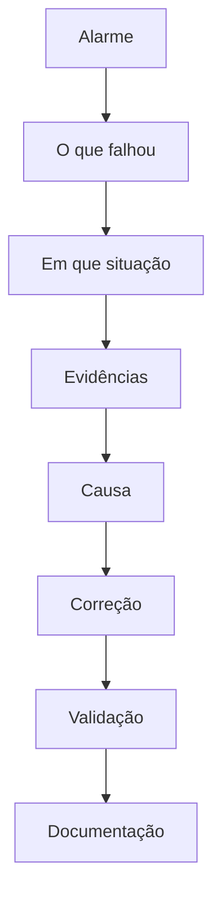

# Roberto Jeronimo da Cunha

**Coordenador de TI e Infraestrutura Industrial · Linux · Redes · Segurança da Informação · Python · PHP · Automação Industrial**

Campinas, São Paulo, Brasil

[English](README.en.md) · [LinkedIn](https://www.linkedin.com/in/robertojeronimo/) · beto1979@gmail.com · roberto@cunha.net.br · (19) 99255-9334

Trabalho com infraestrutura de TI e manutenção industrial. Na [Planifer Ferramentaria e Estamparia](#experiencia), desde 2006, a atuação junta administração de servidores Linux, redes, automação e o chão de fábrica. O ponto de partida é sempre o fato observado, não a suposição.

## Índice

- [Sobre mim](#sobre-mim)
- [Experiência](#experiencia)
- [O que eu faço](#o-que-eu-faco)
- [Tecnologias](#tecnologias)
- [Projetos](#projetos)
- [Troubleshooting e resolução de problemas](#troubleshooting)
- [Conhecimento técnico](#conhecimento-tecnico)
- [Atualmente estudando](#atualmente-estudando)
- [Formação](#formacao)
- [Certificações](#certificacoes)
- [Idiomas](#idiomas)
- [Como eu trabalho](#como-eu-trabalho)
- [Repositório](#repositorio)

## Sobre mim

Bacharel em Ciência da Computação e técnico em Informática Industrial pelo Centro Universitário Salesiano de São Paulo (UNISAL). O trabalho profissional em tecnologia começa em 1998, no suporte de informática, e segue em manutenção eletrônica, infraestrutura e desenvolvimento.

Desde março de 2006 estou na Planifer Ferramentaria e Estamparia, em Campinas, entre a infraestrutura de TI e a manutenção industrial. O dia a dia cobre servidores Linux, Samba Active Directory, rede, proxy, VPN, aplicações em Python e PHP, e a integração disso com máquina, manutenção e indicador.

Na prática, isso aparece como troubleshooting: ler o alarme, situar o que falhou, reunir evidência e só então corrigir.

## Experiência

### Planifer Ferramentaria e Estamparia

Técnico de Manutenção Industrial · Infraestrutura de TI e Automação

Março de 2006 — atual · Campinas e região

- Administração de servidores e migração de serviços críticos para Ubuntu Server com Samba Active Directory
- Autenticação centralizada, políticas de acesso e permissões
- Serviços de e-mail (Postfix), proxy (Squid), VPN (OpenVPN), DNS e compartilhamentos
- Acesso a informações corporativas reestruturado, com aplicação web no lugar de compartilhamentos expostos
- NOC para monitoramento contínuo da infraestrutura
- Aplicações em Python (FastAPI, Selenium) e PHP (HTMX, DataTables), com SQL Server e Supabase
- Ferramentas de monitoramento, inventário, manutenção industrial e integração entre sistemas
- Automação com PowerShell, logs em JSON/UTF-8 e trilha de auditoria
- Liderança técnica e mentoria na resolução de incidentes
- Interface técnica em auditorias de clientes do setor aeroespacial, nos requisitos AS9100 e NADCAP
- Estudos de viabilidade (CAPEX/OPEX) para infraestrutura e eficiência energética

### Liceu Coração de Jesus

Técnico de Manutenção Eletrônica

Abril de 2002 — março de 2006 · Campinas e região

Continuidade da infraestrutura iniciada na Escola Salesiana São José, na mesma comunidade acadêmica.

- Administração Novell NetWare
- Contas de e-mail, usuários e políticas de acesso para mais de 1.000 usuários, entre alunos, professores e equipes administrativas
- Manutenção preventiva dos laboratórios de informática e suporte aos setores administrativos
- Imagens padronizadas de sistema operacional para instalação e recuperação

### Escola Salesiana São José

Técnico de Manutenção Eletrônica

Setembro de 2001 — abril de 2002 · Campinas e região

- Administração de rede em Novell NetWare
- Usuários, contas de e-mail e permissões
- Suporte a laboratórios de informática e setores administrativos
- Manutenção preventiva e corretiva de computadores e periféricos

### A. Carvalho & Souza Ltda

Técnico de computador

Janeiro de 2001 — setembro de 2001 · Campinas e região

- Manutenção preventiva e corretiva de computadores e impressoras em garantia
- Atendimento em laboratório e em campo, para clientes públicos e privados
- Diagnóstico, troca de componente, teste e restauração dentro do padrão de garantia

### Sudeste Serviços de Terceirização Ltda.

Auxiliar de Serviços Gerais

Janeiro de 1998 — setembro de 2001 · Campinas e região

Terceirizado na Secretaria de Informática do TRT da 15ª Região.

- Manutenção preventiva e corretiva de computadores dos setores administrativos e judiciais
- Suporte remoto e atendimento telefônico
- Instalação e padronização de estações de trabalho
- Participação na preparação da infraestrutura para a transição do ano 2000

## O que eu faço

<table>
  <tr>
    <td valign="top" width="33%">
      <h3>Infrastructure &amp; IT</h3>
      <ul>
        <li>Linux Server</li>
        <li>Samba Active Directory</li>
        <li>Networking</li>
        <li>DNS</li>
        <li>DHCP</li>
        <li>Proxy</li>
        <li>Firewall</li>
        <li>VPN</li>
        <li>Backup</li>
        <li>Monitoring</li>
        <li>Virtualization</li>
      </ul>
    </td>
    <td valign="top" width="33%">
      <h3>Development &amp; Automation</h3>
      <ul>
        <li>Python</li>
        <li>PowerShell</li>
        <li>Bash</li>
        <li>PHP</li>
        <li>JavaScript</li>
        <li>PostgreSQL</li>
        <li>APIs</li>
        <li>Aplicações web</li>
        <li>Automação</li>
      </ul>
    </td>
    <td valign="top" width="33%">
      <h3>Industrial</h3>
      <ul>
        <li>CNC</li>
        <li>Manutenção industrial</li>
        <li>Manutenção preventiva</li>
        <li>Manutenção corretiva</li>
        <li>Sistemas elétricos</li>
        <li>Eletrônica</li>
        <li>Redes industriais</li>
        <li>Indústria 4.0</li>
        <li>CMMS / EAM</li>
      </ul>
    </td>
  </tr>
</table>

JavaScript entra no conjunto usado em aplicações web. Não é o centro da atuação, que está em infraestrutura, automação e manutenção.

## Tecnologias

A lista reúne tecnologias de trabalho e de estudo. A profundidade não é a mesma em todos os itens.

### Sistemas operacionais

Linux · Ubuntu Server · Windows Server · Windows

### Infraestrutura

Samba AD · DNS · DHCP · Postfix · Nginx · Squid · Proxmox · ZFS

### Redes

MikroTik · VLAN · OpenVPN · TCP/IP · Routing · Switching

### Desenvolvimento

Python (FastAPI) · PHP (HTMX) · PowerShell · Bash · JavaScript · SQL

### Bancos de dados

PostgreSQL · SQL Server · Supabase

### Monitoramento

Grafana · dashboards · logs · Syslog · sistemas de monitoramento

### Industrial

CNC · Siemens · Mazak · DMG Mori · Romi · sistemas de manutenção

## Projetos

Os textos descrevem problema, arquitetura e resultado esperado. Código de aplicação, topologia e dados de operação não são publicados.

### Planifer InfraMonitor

Dashboard para acompanhar a infraestrutura de TI: servidores, disponibilidade, backups, internet, VPN, logs, indicadores e alertas.

[Problema, arquitetura e limites](projects/inframonitor/README.md)

### CMMS / EAM para manutenção industrial

Gestão de máquinas e equipamentos: cadastro, TAG, planos preventivos, corretivas, ordens de serviço, histórico, estoque e indicadores (MTBF, MTTR, OEE).

[Problema, arquitetura e indicadores](projects/cmms/README.md)

### Automação de tarefas administrativas

Rotinas em PowerShell, Python e Bash para consulta de sistema, checagem de disco, serviço, log, alcance de rede e idade de arquivo de backup. Os scripts deste repositório rodam sozinhos, sem depender de uma rede real.

[Exemplos publicáveis](projects/other/README.md)

## Troubleshooting e resolução de problemas

Investigar bem vale mais do que acertar uma troca no escuro. O diagnóstico começa pelo alarme e pelas evidências. A hipótese vem depois, e só permanece se os fatos a sustentam.

1. Identificar o alarme
2. Identificar o que está apresentando o problema
3. Entender em que situação ocorreu
4. Levantar evidências
5. Identificar a causa
6. Corrigir
7. Validar
8. Documentar

Casos ilustrativos, com nomes e endereços fictícios:

- [Linux](documentation/troubleshooting/linux.md)
- [Samba / Kerberos](documentation/troubleshooting/samba-kerberos.md)
- [Windows](documentation/troubleshooting/windows.md)
- [Redes](documentation/troubleshooting/networking.md)
- [Backup](documentation/troubleshooting/backup.md)
- [Banco de dados](documentation/troubleshooting/database.md)
- [Máquinas industriais](documentation/troubleshooting/industrial-machines.md)

[Método completo](documentation/troubleshooting/README.md)

## Conhecimento técnico

| Área | Conhecimentos |
|---|---|
| Linux | Ubuntu Server, serviços, logs, systemd |
| Windows | Windows Server, PowerShell, GPO |
| Active Directory | Samba AD, DNS, Kerberos |
| Networking | TCP/IP, VLAN, OpenVPN, routing |
| Virtualização | Proxmox, máquinas virtuais |
| Storage | ZFS, backup, recuperação |
| Desenvolvimento | Python (FastAPI), PHP (HTMX), Bash, PowerShell |
| Banco de dados | PostgreSQL, SQL Server, Supabase |
| Industrial | CNC, manutenção, eletrônica |
| Monitoramento | dashboards, logs, alertas |
| Segurança | hardening, controle de acesso, backups |

## Atualmente estudando

Temas em estudo. Conclusão e instituição não são afirmadas quando essa informação não está disponível.

- MBA em Gestão da Manutenção, em andamento
- Gestão industrial
- Data Science e Analytics
- Indústria 4.0
- Lean Manufacturing
- TPM
- OEE
- Supply Chain
- Gestão da produção

[Notas de estudo](documentation/studies/README.md)

## Formação

- Bacharelado em Ciência da Computação, Centro Universitário Salesiano de São Paulo (UNISAL), 2004–2008
- Técnico em Informática Industrial, UNISAL, 2002–2004
- MBA / pós-graduação em Gestão da Manutenção, em andamento

## Certificações

Cursos concluídos. A lista com emissor, data e código de credencial está em [documentation/certificacoes.md](documentation/certificacoes.md).

- Formação para a Primeira Liderança, FM2S, 2025
- Comunicação Não Violenta, Comunicação Assertiva e Inteligência Emocional, FM2S, 2025
- Excel Corporativo do Básico ao Avançado, Supernova Treinamentos, 2018
- NR-35 — Trabalho em Altura, Planifer, 2012
- Controladores Lógicos Programáveis, UNISAL, 2002
- Planejamento e Controle da Manutenção, SigaConsulting, 2007
- Manutenção mecânica e eletro-eletrônica, Siemens 810D, ROMI, 2008
- Redução de gastos em energia elétrica, CIESP Campinas, 2010
- Manutenção elétrica e manutenção mecânica, INDEX, 2011
- Aplicação e manutenção de rolamentos industriais, Radial Rolamentos, 2018

## Idiomas

- Português
- Inglês, profissional limitado

## Como eu trabalho

- Entender o problema antes de agir
- Trabalhar com evidências
- Documentar o que foi visto e o que foi feito
- Automatizar tarefa repetitiva quando isso reduz erro
- Buscar a causa, não só o sintoma
- Reduzir indisponibilidade com correção que se sustenta
- Preferir solução simples de operar e de manter
- Integrar tecnologia com a operação
- Transformar problema recorrente em processo

## Repositório

| Pasta | Conteúdo |
|---|---|
| [infrastructure](infrastructure/README.md) | Linux, Samba AD, redes, Proxmox, backup, monitoramento, Squid |
| [automation](automation/README.md) | Exemplos em PowerShell, Python, Bash e PHP |
| [industrial](industrial/README.md) | Manutenção, CNC, monitoramento industrial, Indústria 4.0 |
| [projects](projects/README.md) | InfraMonitor, CMMS e automações |
| [documentation](documentation/README.md) | Troubleshooting, arquitetura, procedimentos, estudos |
| [examples](examples/README.md) | Configurações e diagramas de laboratório |

Os exemplos usam apenas referências de documentação: `example.com`, `192.0.2.0/24`, `198.51.100.0/24`, `203.0.113.0/24` e `10.0.0.0/24`.

O código de exemplo está sob a licença [MIT](LICENSE).

Textos sugeridos para bio, descrição e links do perfil: [documentation/profile-github.md](documentation/profile-github.md).
