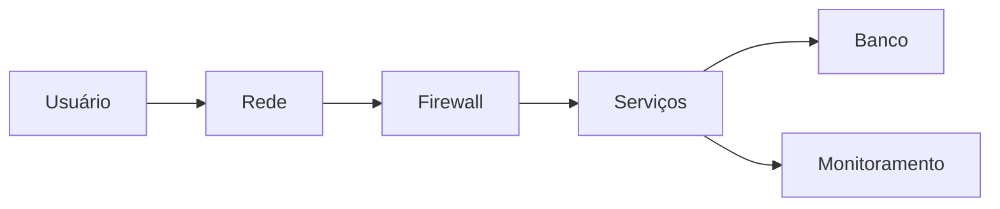
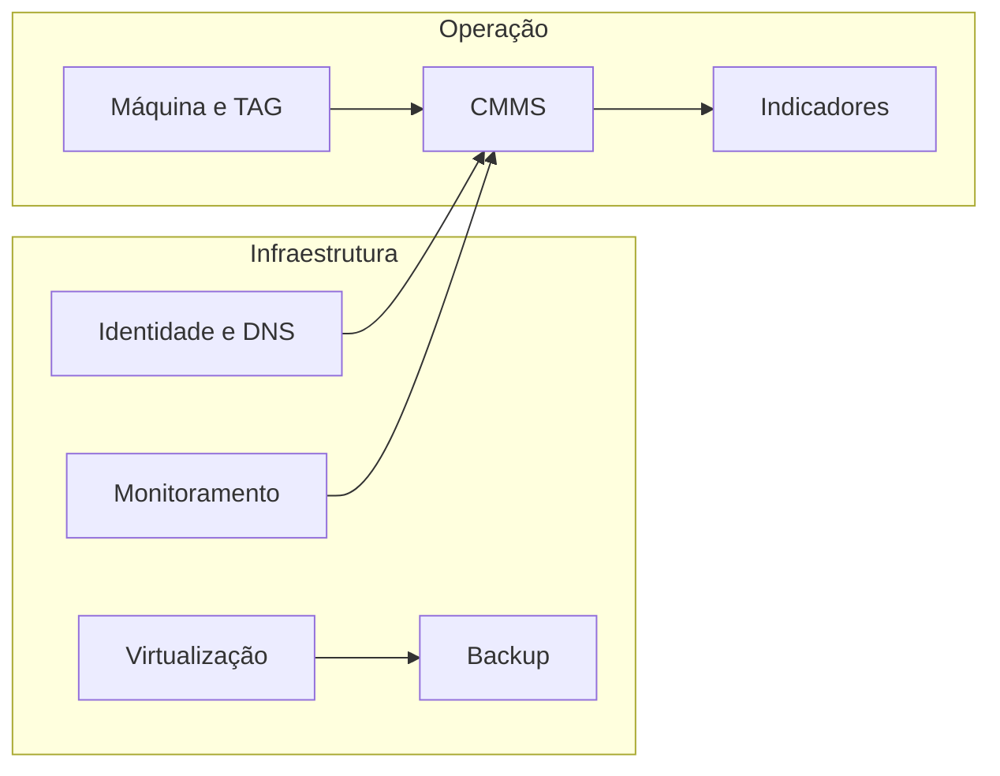

# TI e operação industrial

A infraestrutura e a manutenção se encontram no cadastro, no horário e no histórico. Sem isso, o alarme da máquina e a ordem de serviço não falam da mesma coisa.

Desenho genérico de passagem. Não é a rede de nenhuma organização.

## Pontos de encontro

| Ponto | Por que importa |
|---|---|
| TAG | O mesmo equipamento no chão de fábrica e no sistema |
| Relógio | Evento, log e ordem na mesma linha do tempo |
| Backup | Configuração e histórico recuperáveis fora da máquina que falhou |
| Monitoramento | Parada visível antes do relato informal |
| Ordem de serviço | A correção volta para o histórico da TAG |

Rede industrial, endereço de CLP e layout não aparecem neste desenho.
