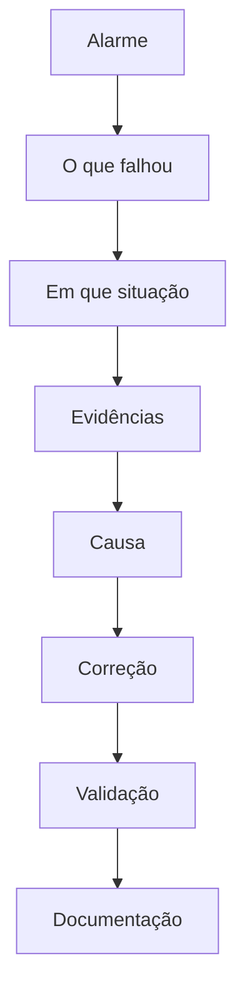

# Troubleshooting e resolução de problemas

O diagnóstico começa pelos fatos. Uma hipótese sem evidência é só um palpite, e palpite aplicado em produção aumenta o estrago.

## Sequência

1. **Identificar o alarme.** Mensagem, código, sintoma relatado. Anotar a hora.
2. **Identificar o que apresenta o problema.** Host, serviço, máquina, eixo, link. Um nome só.
3. **Entender em que situação ocorreu.** Depois de qual mudança, em qual movimento, para qual usuário, em qual rede.
4. **Levantar evidências.** Log, estado, contador, tamanho de arquivo, desvio de relógio, relato objetivo. Guardar antes de alterar.
5. **Identificar a causa.** A explicação que os fatos sustentam. Se dois fatos discordam, a causa ainda não fechou.
6. **Corrigir.** A menor mudança que ataca a causa, com caminho de retorno.
7. **Validar.** O alarme sumiu e o comportamento esperado voltou. Inclusive o caso que falhava, não um teste vizinho.
8. **Documentar.** Sintoma, evidência, causa, ação e como validar de novo.

## Casos ilustrativos

Todos usam nomes e endereços de laboratório.

- [Linux: disco em /var](linux.md)
- [Samba / Kerberos: relógio](samba-kerberos.md)
- [Windows: serviço dependente](windows.md)
- [Redes: VLAN da porta de acesso](networking.md)
- [Backup: job verde e arquivo vazio](backup.md)
- [Banco de dados: conexões esgotadas](database.md)
- [Máquina CNC: alarme na troca de ferramenta](industrial-machines.md)
