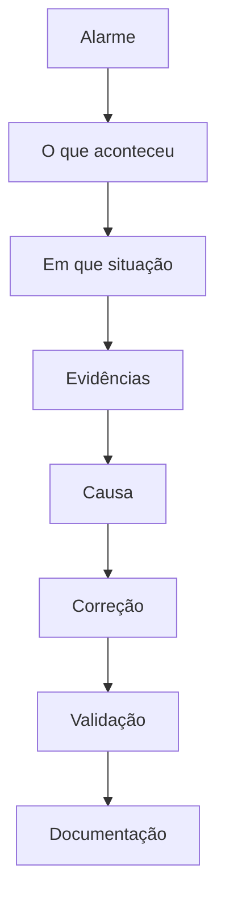

# Troubleshooting

Antes da solução, vem o diagnóstico. A hipótese sem evidência não vira ação.

```text
ALARME
   ↓
O QUE aconteceu?
   ↓
EM QUE situação?
   ↓
EVIDÊNCIAS
   ↓
CAUSA
   ↓
CORREÇÃO
   ↓
VALIDAÇÃO
   ↓
DOCUMENTAÇÃO
```



## Casos

Todos são exemplos didáticos baseados em situações comuns de infraestrutura. Nomes e endereços são fictícios.

| Caso | Arquivo |
|---|---|
| Serviço Linux | [linux-service.md](linux-service.md) |
| Samba / Kerberos | [samba-kerberos.md](samba-kerberos.md) |
| Conectividade | [network-connectivity.md](network-connectivity.md) |
| Backup | [backup-failure.md](backup-failure.md) |
| Logon Windows | [windows-logon.md](windows-logon.md) |
| Banco de dados | [database-problem.md](database-problem.md) |
| Máquina CNC | [industrial-machines.md](industrial-machines.md) |

Cada caso segue sintoma, contexto, evidências, hipóteses, investigação, causa, correção, validação, prevenção e lições aprendidas.
