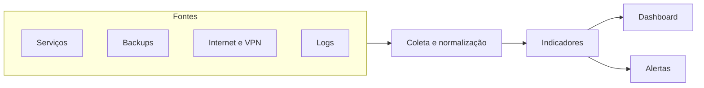

# Arquitetura — Planifer InfraMonitor

Visão lógica. Caixas sem nome de host e sem endereço.

## Fluxo

1. Cada fonte entrega um fato verificável: porta aberta, arquivo dentro da idade, linha de erro, estado do serviço.
2. A normalização usa o mesmo relógio e o mesmo nome de componente.
3. O indicador compara o fato com um limiar escrito.
4. O dashboard mostra o estado atual e o histórico curto.
5. O alerta sai só quando o limiar é cruzado, para um destino com dono.

## O que fica fora do desenho

Topologia, VLAN, faixa de endereço, certificado, usuário de coleta e regra de firewall.
